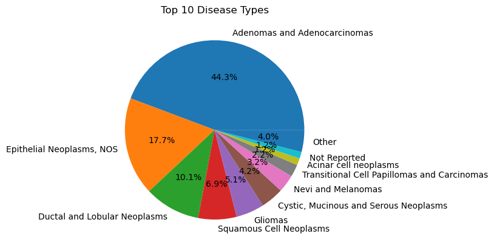
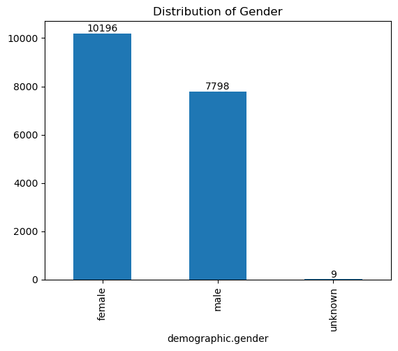
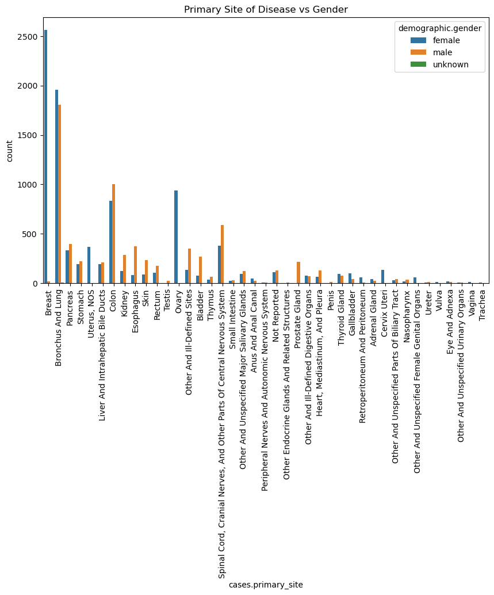
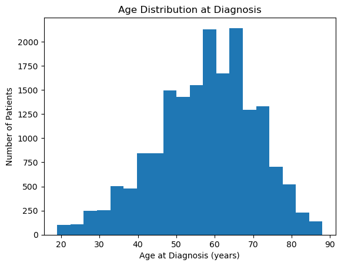

## Example of the final output of the cancer data analysis project

Below are several findings that you would be able to uncover after going through the data analysis workflow of this workshop. However, these findings are merely a starting point. There are many more analysis and visualizations that can be created.

### Distribution of disease types

As we can see, the disease type with the highest count is Adenomas and Adenocarcinomas followed by Epithelial Neoplasms, NOS. Understanding the distribution of disease types helps identify the most common and rare cancers in the dataset, which is crucial for allocating resources and prioritizing research.

### Gender demographic

Gender information was available from all but 9 samples and showed a slight bias toward females versus males.

This bias can be explained in part by the large number of breast and GYN cancer samples within the dataset since both breast and gynecological cancers are specific to females. Therefore, a dataset with a large number of these samples would naturally have more female participants than male.

### Age distribution

The study "High-Throughput Genomic Profiling of Adult Solid Tumors" utilized patient samples that were part of routine clinical care, which were submitted for genomic profiling by Foundation Medicine. As we can see from the graph above, the sampling reflects close to a normal distribution of those who seek genomic profiling or those recommended for such tests by their healthcare providers.

Therefore, although the data were not collected through random sampling, the dataset exhibits substantial diversity, featuring nearly equal representation across genders and a normal distribution in age.