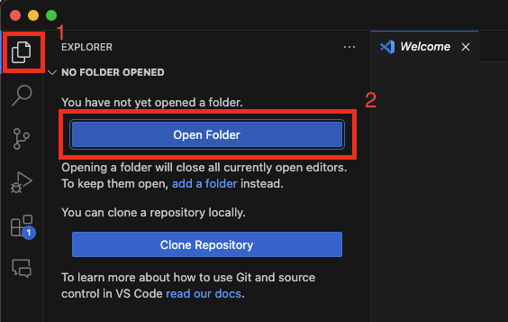
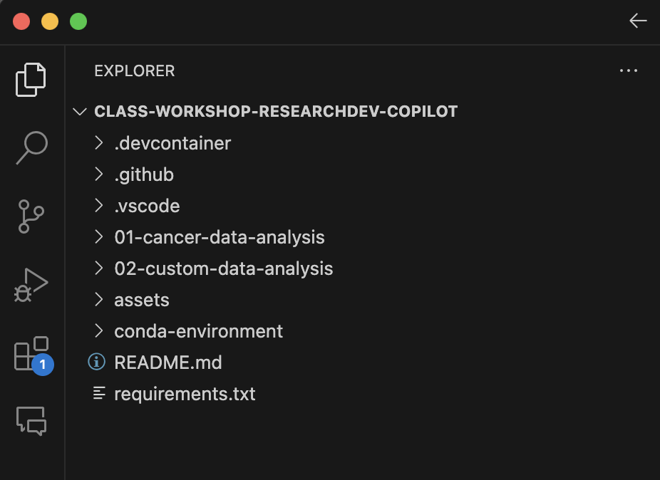

# Power Up Research Software Development with Github Copilot - July 10, 2024, 9 am PT/12 pm ET
In this 4-hour workshop, you will learn how to use Github Copilot to write better and faster research software and create documentation to describe your workflow and code. The lesson will utilize a genomics dataset from the AWS Open Data program. You will also learn to analyze and visualize the dataset using open-source tools. 

## Sign Up for the workshop
Link to register: https://tinyurl.com/2ypvbc9v
- Cost: Free for Internet2 members, $50 for non-members. 

## Pre-requisites
You **MUST** pre-install and obtain access to the following before the start of the workshop. GitHub Copilot accounts WILL NOT be provided. 

> [!NOTE]
> Please be aware that when signing up for the free trial of GitHub Copilot you will be asked to submit a form of payment even though you will not be charged until the free trial is over. Ensure you cancel before the 30 days is over to avoid payment.


- [Visual Studio Code](https://code.visualstudio.com/)
- [Conda](https://conda.io/projects/conda/en/latest/user-guide/install/index.html)
- [GitHub account](https://github.com/)
- [GitHub Copilot](https://github.com/features/copilot)
- [GitHub Copilot Visual Studio Extension](https://marketplace.visualstudio.com/items?itemName=GitHub.copilotvs)


## Agenda (subject to change)

### Introduction (15 mins)
- What is a coding companion?
- Why use a coding companion for research software development?
- What are the different coding companions?

### Overview of GitHub Copilot (15 mins)
- The main features of GitHub Copilot
- Navigating the GitHub Copilot interface and prompts
- GitHub Copilot Chat

### Hands-on Lab - Part 1 (90 mins)
- Accessing large datasets on AWS
- Working with Jupyter Notebooks
- Using GitHub Copilot to analyze and visualize datasets

### Break - 20 mins

### Hand-on Lab - Part 2 (60 mins)
- Using GitHub Copilot to develop code
- Using GitHub Copilot to explain code
- Using GitHub Copilot to document code
- Choose your adventure

### Takeaways and closing remarks (30 mins)
- Continue analyzing the current data set
- Lessons learned


## Getting started

1. **Clone the repository**

   First, clone the repository to your local machine and navigate to the directory where the repository is cloned. Open up the terminal in your computer, navigate to the directory you want to store the files to this repo in, and run the following command:

   ```bash
   git clone https://github.com/Internet2/class-workshop-researchdev-copilot.git
   ```
2. **Verify via Command Line Interface (CLI)**

    Verify that you successfully cloned the repo by running the following command:

    ```bash
    ls
    ```

    You should see the same directory structure as the one in the GitHub repo online.

3. **Open repo on Visual Studio Code**

    Now you are ready to start the workshop. Open up Visual Studio Code on your computer and open the folder that houses the repo.

    

    You should see a directory structure that looks like the one in the screenshot below. (There may be slight differences between the files shown in the screenshot and the one you see in your Visual Studio Code since the GitHub repo is continually updated).

    
