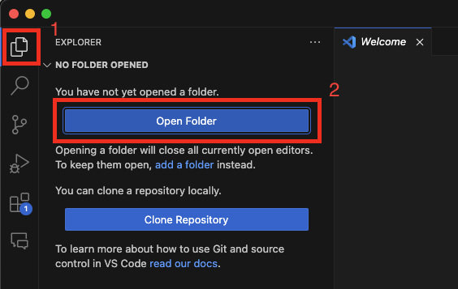
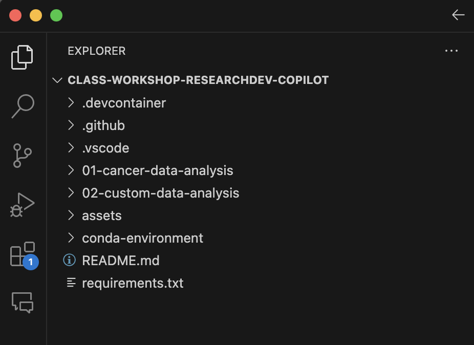

# Power Up Research Software Development with Github Copilot

In this 3-hour workshop, you will learn how to use Github Copilot to write better and faster research software and create documentation to describe your workflow and code. The lesson will utilize a genomics dataset from the AWS Open Data program. You will also learn to analyze and visualize the dataset using open-source tools. 

## Pre-requisites
You **MUST** pre-install and obtain access to the following before the start of the workshop. GitHub Copilot accounts WILL NOT be provided. 

> [!NOTE]
> There are two ways to use GitHub Copilot for free:
> 1. Use the free tier of GitHub Copilot. While there are limits on the number of requests, this tier is sufficient for the workshop. However, if you tend to engage extensively with the built-in Copilot Chat, you may want to consider the second option. Learn more about the limits [here](https://docs.github.com/en/copilot/about-github-copilot/subscription-plans-for-github-copilot#comparing-copilot-subscriptions).
> 2. Sign up for the free trial of GitHub Copilot Pro. Note that a payment method is required at sign-up, but you will not be charged until the trial ends. Make sure to cancel before the 30-day trial expires to avoid any charges. Learn more [here](https://docs.github.com/en/copilot/managing-copilot/managing-copilot-as-an-individual-subscriber/subscribing-to-copilot-as-an-individual-user)


- [Visual Studio Code](https://code.visualstudio.com/)
- [Venv](https://docs.python.org/3/library/venv.html)
- [Python 3.10 or higher](https://www.python.org/downloads/)
- [GitHub account](https://github.com/)
- [GitHub Copilot](https://github.com/features/copilot)
- [GitHub Copilot Visual Studio Extension](https://marketplace.visualstudio.com/items?itemName=GitHub.copilotvs)
- [Docker](https://www.docker.com/get-started/)
- [Docker Compose](https://docs.docker.com/compose/install/)


## Agenda (subject to change)

1. Introduction & Tool Overview (20 minutes)
   - Welcome and objectives
   - GitHub Copilot features walkthrough
   - Privacy settings ([disable training on your data](https://github.com/settings/copilot/features))
   - Premium requests management ([spending limits](https://github.com/settings/billing/budgets))

2. Notebook Repository - Data & Backend Focus (40 minutes)
   - Working with data processing code
   - Backend logic enhancement

3. Break (10 minutes)

4. Container Orchestration Repository - UI/Frontend Focus (60 minutes)
   - Basic UI Refactoring (25 minutes)
     - CSS organization and separation
     - Simple styling improvements
   - Advanced UI Development (35 minutes)
     - Prompting strategy demonstration
     - Generic vs. detailed prompts comparison

5. Break (10 minutes)

6. Prompt Engineering Best Practices (30 minutes)
   - Specificity and context
   - Requesting alternatives and feedback
   - Iteration and refinement techniques

7. Q&A (10 minutes)


## Getting started

1. **Clone the repository**

   First, clone the repository to your local machine and navigate to the directory where the repository is cloned. Open up the terminal in your computer, navigate to the directory you want to store the files to this repo in, and run the following command:

   ```bash
   git clone https://github.com/Internet2/class-workshop-researchdev-copilot.git
   ```
2. **Verify via Command Line Interface (CLI)**

    Verify that you successfully cloned the repo by running the following command:

    ```bash
    ls
    ```

    You should see the same directory structure as the one in the GitHub repo online.

3. **Open repo on Visual Studio Code**

    Now you are ready to start the workshop. Open up Visual Studio Code on your computer and open the folder that houses the repo.

    

    You should see a directory structure that looks like the one in the screenshot below. (There may be slight differences between the files shown in the screenshot and the one you see in your Visual Studio Code since the GitHub repo is continually updated).

    
