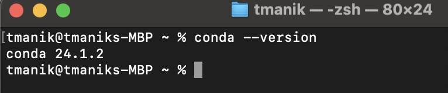
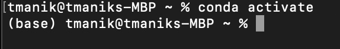

## Pre-Workshop Checklist

Before attending the workshop, please ensure that you have the required prerequisites installed and configured properly. Follow the steps below to verify your setup.

### Repository Update

Make sure that you have cloned the repository. You can see instructions on how to do so on the [Getting Started](../README.md#getting-started) section of main page of this repository.

If you have already done that, ensure you have the latest content from the repository.

1. Open your terminal and navigate to the directory where you have cloned the repository.
2. Run the following command to update your remote references:
    ```bash
    git remote update
    ```
3. Check the status of your branch with this command:
    ```bash
    git status -uno
    ```
    - If your branch is up to date, you will see:  ```Your branch is up to date with 'origin/main'.```
    - If your branch is not up to date, you will see a message like: ```Your branch is behind 'origin/main' by X commits...```
4. If your branch is behind, update it with:
    ```bash
    git pull
    ```

### Conda Installation

Verify that Conda is installed and you can activate environments.

1. Check the Conda version:
    ```bash
    conda --version
    ```
    - You should see an output similar to:
        ```
        conda X.Y.Z
        ```
    - Example:

        

2. Test environment activation:
    - Activate the base Conda environment:
        ```bash
        conda activate
        ```
        - You should see `(base)` appended before your username in the terminal.
        - Example:
        
            
    - Deactivate the base Conda environment:
        ```bash
        conda deactivate
        ```

This checklist will help ensure that you have the necessary setup for a smooth workshop experience. If you encounter any issues, please check out the [Troubleshooting Guide](../03-troubleshooting-guides/README.md) or reach out to the workshop organizers for further assistance.
